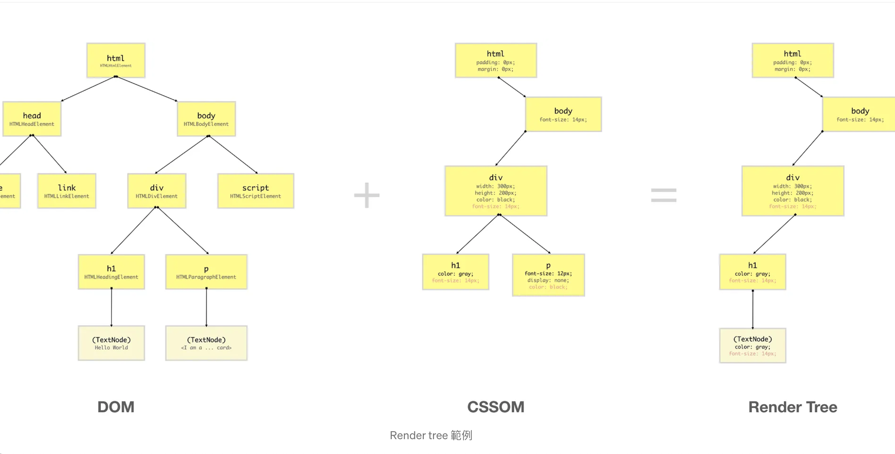

# Browser-Rendering

1. **取得 HTML 文檔**
瀏覽器發送 request to server 取得 html 文檔(以 **binary stream format** 被傳輸)，其 header 標示 **Conent-Type: text/html; chatset=UTF-8**，瀏覽器才知道如何解析該文檔，不然會以純文字的方式顯示 html 內容

2. **建立 HTML DOM （瀏覽器解析 HTML 文檔）**
將HTML元素(如`HTML`、`body`以及`div`等等)解析成 Node 節點(一個 JavaScript 物件)，最終這些節點會被組織成一個**樹狀**的資料結構，簡稱爲 **DOM Tree。
DOM Tree 會保留與 HTML 標籤相似的結構，但改為使用 Node 物件建構節點，使得瀏覽器更易於有效管理並渲染頁面。**

<aside>
💡 *DOM Tree 中的節點未必是 HTML 元素。*如註解（comment）、屬性（attribute）或是文字等等，也以節點的形式儲存在 DOM tree 中。

</aside>

<aside>
💡 JavaScript 本身不知道 DOM 是什麼，DOM 並不包含在 JS 的標準當中。
DOM 屬於高階的 **Web API** 的一部份

透過 DOM API，開發者可以進行諸如新增或移除 HTML元素；
改變它們的外觀；或是綁定事件監聽器等行為。

透過 DOM API，HTML 元素可以**在記憶體內被建構或複製**，在不影響 render tree 的前提下被修改。

</aside>

1. **建立 CSSOM（瀏覽器解析樣式 style 標籤, inline-styling, 外部css檔案, 透過 JS 改變樣式等）**
在建立 DOM Tree後，瀏覽器會解析所有來源（包含外部引用、內嵌、行內以及瀏覽器的預設樣式等等）讀取 CSS 並建立起另一個**樹狀**的資料結構，簡稱為 **CSSOM Tree**。

**CSSOM** 中的節點都包含了樣式的資訊，並依照 selector 的標記套用至目標的 DOM 元素上，
但並不包含那些不會被顯示至畫面上的 HTML 元素的樣式，例如`meta`、`script`與`title`等。

<aside>
💡 某些特定 HTML 元素，若沒顯性的設定其 CSS 樣式，

1. 自動採用 **W3C CSS** 標準中所標示的**預設值**

2. 某些特定CSS屬性，則遵循 W3C 文件的標示，採用**繼承（inheritance）**的規則
如：`color`與`font-size` 在 HTML 元素沒有提供樣式的設定值時，會預設為繼承父元素的設定

</aside>

1. **建立 Render Tree（結合了 DOM tree 以及 CSSOM tree 產生的樹狀結構）**
瀏覽器透過 render tree 來計算 **layout（排版）**並且將可視元素 **paint（繪圖）**至畫面中，**在 render tree 建構完成前，畫面上將不會有任何內容。**

<aside>
💡 Render tree 是一個對於畫面內容低階的結構描述，它不會包含那些在畫面中不佔有空間的節點。

P.S. 如 `display:none` 的元素，該元素所佔的空間將會是`0px X 0px`，因此將不會出現在 Render tree 中。

</aside>

<aside>
💡 瀏覽器並沒有針對 CSSOM Tree 提供像是 DOM API 的介面來「**直接」**操作 CSSOM。

但因為瀏覽器會將 DOM 以及 CSSOM 結合來產生 Render tree，
便能**透過存取 DOM 元素**來**取得對應的 CSSOM 節點**的高階 API
使得開發者依然**得以存取或改變 CSSOM 節點的屬性**

</aside>

1. **渲染流程（瀏覽器渲染（render）一個標準的HTML到畫面上）
解析 HTML** 內容 → 建立 **DOM Tree** → 建立 **CSSOM Tree** → 建立 **Render Tree** → 瀏覽器**渲染（render）**元素到畫面上

而 ****渲染（render）還可分作三個階段 reflow(Layout) → repaint → Compositing****

TODO: reflow, repaint, compositing…etc